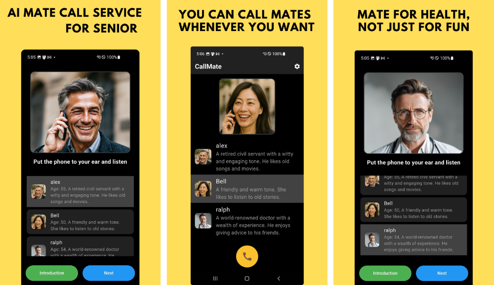

<link href="callmate.css" rel="stylesheet"/>

# CallMate
## The Friend Who Wants to Hear Your Story
> *"I wish that mate would call. I'd have so much to chat about."*
We all have moments when we feel this way. Wishing for that friend who would just call out of the blue.
- <button onclick="showImagePopup()" style="background-color:#ff007f;border-radius:20px;">.     Download Callmate    .</button>
- 

## CallMate is for people who:

- Want to share everyday conversations with someone
- Would like to receive a friendly check-in call at regular times
- Prefer the familiar experience of phone calls over complicated apps

## What Makes CallMate Special

### 📞 Just Like a Real Phone Call
No complicated chat apps. Simply answer, talk, and hang up—just like a regular phone call.

### ⏰ Your Friend Calls You
Unlike other AI apps, CallMate will call you once a day during your preferred time window.

### 🗣️ Comfortable Conversation Partners
Choose between Alex (55, gentle and caring) and Bell (52, wise and attentive)—whichever friend feels right for you.

### 💬 Remembers Your Conversations
Your friend will remember previous conversations and naturally continue where you left off.

## How to Get Started

1. Install the app and enter just a few simple details
2. Select the friend you'd like to chat with
3. Set your preferred time window for receiving calls
4. Now you can call your friend anytime, or wait for them to call you

## Daily Life with CallMate

"Alex called me this morning and we chatted about the weather. He reminded me to drink plenty of water during this hot weather. Thanks to him, I started my day with a smile."

"When I shared my old memories with Bell, she was so understanding. I'm already looking forward to what we'll talk about next time."

## Start Now

A friend who's ready to listen to your story is waiting for you.

*An AI companion for friendly conversations.* 

- <button onclick="showImagePopup()" style="background-color:#ff007f;border-radius:20px;">.     Download Callmate     .</button>

- [Terms of service](terms_callmate_en), [Privacy Policy](privacy_callmate_en), [Contact](mailto:hello@t-gi.co)
- T-GI.co