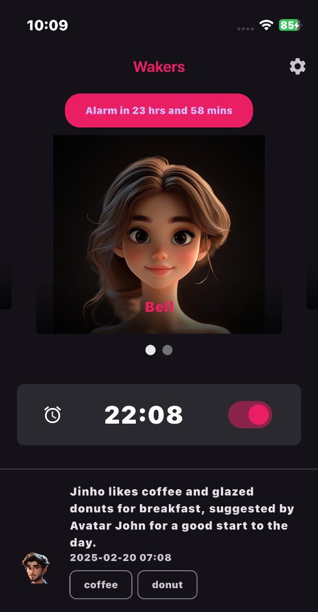

<link href="wakers.css" rel="stylesheet"/>

# Happy morning with Wakers
- Start your morning off right with a wake-up call from a charming AI friend.
- <button onclick="showImagePopup()" style="background-color:red;border-radius:20px;">.     Download Wakers     .</button>
- 

# Wakers features
## Wake up to pleasant conversations, not loud noises

## Befriend and romance different avatars

## A lot of information while in bed
<svg width="360" height="120" xmlns="http://www.w3.org/2000/svg">
  <defs>
    <!-- 붉은색 계열 그라데이션 정의 -->
    <linearGradient id="gradRed" x1="0%" y1="0%" x2="0%" y2="100%">
      <stop offset="0%" style="stop-color:#FF5E62;stop-opacity:1"/>
      <stop offset="100%" style="stop-color:#FF9966;stop-opacity:1"/>
    </linearGradient>
  </defs>

  <!-- 날씨 앱 아이콘 -->
  <g transform="translate(10,10)">
    <!-- 원형 배경 -->
    <circle cx="50" cy="50" r="50" fill="url(#gradRed)"/>
    <!-- 날씨 아이콘: 태양 + 구름 -->
    <g transform="translate(20,20)" stroke="#ffffff" fill="none" stroke-width="4" stroke-linecap="round" stroke-linejoin="round">
      <!-- 태양 (중앙에 위치, 원형) -->
      <circle cx="30" cy="30" r="8" fill="#ffffff"/>
      <!-- 태양 광선 -->
      <line x1="30" y1="10" x2="30" y2="18"/>
      <line x1="30" y1="42" x2="30" y2="50"/>
      <line x1="10" y1="30" x2="18" y2="30"/>
      <line x1="42" y1="30" x2="50" y2="30"/>
      <line x1="17" y1="17" x2="23" y2="23"/>
      <line x1="37" y1="37" x2="43" y2="43"/>
      <line x1="17" y1="43" x2="23" y2="37"/>
      <line x1="37" y1="23" x2="43" y2="17"/>
      <!-- 구름 -->
      <path d="M55,40 
               a10,10 0 0,0 -10,-10 
               a10,10 0 0,0 -10,10 
               h-10 
               a8,8 0 0,0 0,16 
               h30 
               a8,8 0 0,0 0,-16z"/>
    </g>
  </g>

  <!-- 뉴스 앱 아이콘 -->
  <g transform="translate(130,10)">
    <!-- 원형 배경 -->
    <circle cx="50" cy="50" r="50" fill="url(#gradRed)"/>
    <!-- 뉴스 아이콘: 신문 모양 -->
    <g transform="translate(15,20)" stroke="#ffffff" fill="none" stroke-width="4" stroke-linecap="round" stroke-linejoin="round">
      <!-- 신문 외곽 -->
      <rect x="0" y="0" width="70" height="60" rx="8" ry="8"/>
      <!-- 텍스트 라인 -->
      <line x1="10" y1="15" x2="60" y2="15"/>
      <line x1="10" y1="25" x2="60" y2="25"/>
      <line x1="10" y1="35" x2="60" y2="35"/>
      <line x1="10" y1="45" x2="60" y2="45"/>
    </g>
  </g>

  <!-- 옷코디 앱 아이콘 -->
  <g transform="translate(250,10)">
    <!-- 원형 배경 -->
    <circle cx="50" cy="50" r="50" fill="url(#gradRed)"/>
    <!-- 옷코디 아이콘: 옷걸이 형태 -->
    <g transform="translate(20,25)" stroke="#ffffff" fill="none" stroke-width="4" stroke-linecap="round" stroke-linejoin="round">
      <!-- 옷걸이 상단 곡선 -->
      <path d="M10,10 Q30,0 50,10"/>
      <!-- 옷걸이 본체 -->
      <line x1="10" y1="10" x2="10" y2="40"/>
      <line x1="50" y1="10" x2="50" y2="40"/>
      <line x1="10" y1="40" x2="50" y2="40"/>
      <!-- 걸이 부분 -->
      <line x1="30" y1="0" x2="30" y2="10"/>
    </g>
  </g>
</svg>

<button onclick="showImagePopup()" style="background-color:red;border-radius:20px;">.     Download Wakers     .</button>

- [Terms of service](terms_wakers_en), [Privacy Policy](privacy_wakers_en), [Contact](mailto:hello@t-gi.co)
- T-GI.co